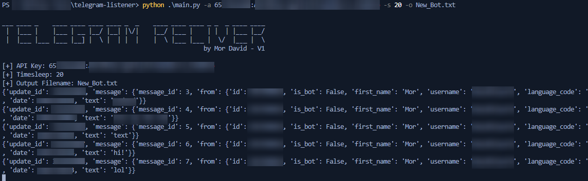

# Telegram Listener
This script serves as a fundamental listener for bot channels on Telegram. Its intended use is to aid in my research on phishing kits.

Here's what each part of a valid Telegram API token represents:
1. **Numeric Identifier (e.g., 1234567890)**: This is a unique numeric identifier for your bot. It's assigned when you create your bot using the BotFather on Telegram.
2. **Colon (:) Separator**: The colon serves as a separator between the numeric identifier and the authentication token.
3. **Authentication Token** (e.g., ABCDefghijklmnopqrstuvwxyz1234567890abcdefghi): This is a long alphanumeric string that acts as a secret key to authenticate your bot with Telegram's servers. It's generated by the BotFather when you create your bot and should be kept confidential.

## Usage
```
usage: telegram-listener.py [-h] -a API_KEY -s TIME_SLEEP -o OUTPUT_FILENAME

optional arguments:
  -h, --help            show this help message and exit
  -a API_KEY, --api-key API_KEY
                        For Example: 1234567890:ABCDEFGHIJKLMNOPQRSTUVWXYZ
  -s TIME_SLEEP, --sleep TIME_SLEEP
                        Seconds
  -o OUTPUT_FILENAME, --output OUTPUT_FILENAME
                        You know.. Output file...
```

## Screenshot


## Articles
- Uncovering a Message Thread Between Hackers Targeting Israeli Citizens [English]\
https://medium.com/cyesec/uncovering-a-message-thread-between-hackers-targeting-israeli-citizens-ba8b922ed1a5
- Phishing The Phisherman [Hebrew]:\
https://www.digitalwhisper.co.il/files/Zines/0x99/DW153-3-PhishingThePhisherman.pdf